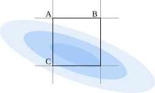

# Math

The Gradient will be calculated per input image, per pixel.

# Color

The pixel's per gaussian transparency $p_\alpha$ is calculated from
$$
p_{\alpha i}=\alpha_i\cdot(\text{CDF}(b_x)-\text{CDF}(a_x)) \cdot (\text{CDF}(c_y)-\text{CDF}(a_y))
$$
where $i$ is the index of the gaussian, $\alpha$ is the transparency parameter, and the CDF is the cumulative distribution function for the gaussian distribution using the 2x2 covariance matrix $\Sigma'$ and mean position $\mu$.

the full pixel's color $p_c$ is calculated from
$$
p_c=(1-P_{\alpha n})W_c+\sum_{i=1}^{n}{(1-P_{\alpha i}) p_{\alpha i}\cdot c}
$$
where $P_{\alpha i}$ is the summed transparency of all gaussians of closer depth, $c$ is the color of the gaussian, and W_c is the world color added after all gaussians.
Note that you are indexing gaussians in order of closest to farthest.

# Gaussian

Each gaussian is described with a 3x3 covariance matrix $\Sigma$ and a 3d vector for mean/position $\mu$.

To render the Gaussian, convert $\Sigma$ to a 2x2 coveraince matrix $\Sigma'$
$$
\Sigma'=JW\Sigma W^\top J^\top
$$
where $J$ is the Jacobian of the camera's projection matrix at point $\mu$, and $W$ is the viewing transform/rotation of the camera.
If you remove the 3rd column and row of $\Sigma'$, then the resulting matrix is a projected 2x2 covariance matrix.

the 2d projected mean $\mu'$ is calculated the same as normal rendering techniques.

## Gradient Descent Parameters

the parameters that can be altered are:
- $\Sigma'$ - diagonal and the siymmetric parameter.
- $\mu'$ - moving up-down and left-right.

My reasoning is that it is computationally easy to verify a 2x2 covariance matrix, and the inverse operations are always present and easily computable.
This choice is different than the original paper, in which the rotation quaternion and 3d position were altered.

the 2d covariance gradient can be converted to 3d covariance gradient with
$$
\nabla \Sigma=W^\top J^{-1}\nabla\Sigma'(J^\top)^{-1}W^\top
$$

the gradient 3d mean can be calculated with 
$$
\nabla\mu=T^{-1}P^{-1}\lambda\hat{\mu'}
$$
where $T$ is the 4x4 camera transformation matrix, $P$ is the 4x4 perspective projection, and $\lambda$ is the parameter for the homogeneous vector $\hat{\mu'}$.

